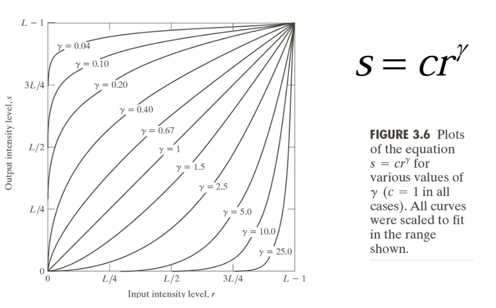
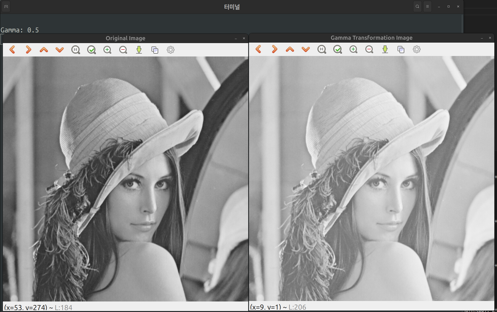
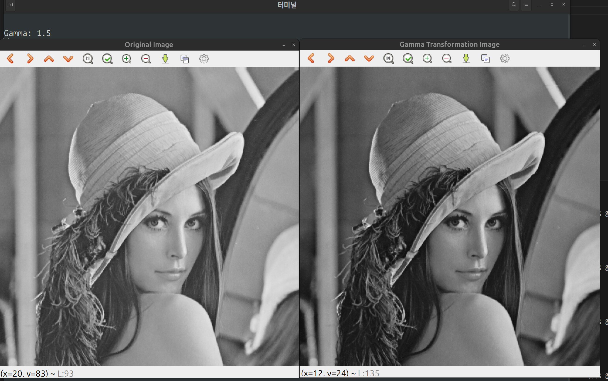

# Gamma Transformation
감마 변환은 **픽셀 강도를 비선형적으로 조정하여 영상의 밝기와 대비를 제어**하는 방법이다.

$$
s = c \cdot r ^{\gamma}
$$

 - $r$ : 입력 픽셀 값
 - $s$ : 변환 후 픽셀 값
 - $\gamma$ : 조정 파라미터
 - $c$ : 스케일링 상수(대부분 1로 설정)

 

 ## 구현
 데이터 접근은, 포인터 형식으로 했다. 포인터로 출력할 이미지에 대해 한 픽셀씩 접근하고,
 한 픽셀에 대해 감마 보정을 적용했다. 

 이중 for문으로 전체 픽셀을 순회하며, 감마보정을 시킨다.
 ```cpp
unsigned char *pData;
    pData = (unsigned char *)img_out.data;

    for (int h = 0; h < img.rows; ++h)
    {
        for (int w = 0; w < img.cols; ++w)
        {
            pData[h * img.rows + w] = gamma_transformation(img, h, w, gamma);
        }
    }
 ```

gamma 보정은 함수로 진행했다.
`gamma_transformation`함수는 현재 처리 중인 픽셀의 위치와 감마 값을 인자로 전달 받는다.

전달 받은 후, 먼저 정규화를 진행하고,

`pow`를 통해 감마보정 식을 적용한다.

리턴할 때는, 다시 `[0, 255]` 로 변환 후 리턴 해준다.

```cpp
static inline unsigned char gamma_transformation(const Mat &src, int h, int w, double gamma)
{
    // 입력 픽셀값
    unsigned char pixel = src.at<uchar>(h, w);

    // [0, 1]로 정규화
    double r = pixel / 255.0;

    // 감마 보정
    double s = pow(r, gamma);

    // 다시 [0, 255] 변환 후 리턴
    return static_cast<unsigned char>(s * 255.0);
}
```

## 결과 영상
결과 영상은 GrayScale Lena 영상에서, 감마값을 순서대로, 0.5, 1.5일때이다.

**$\gamma = 0.5$**


**$\gamma = 1.5$**
