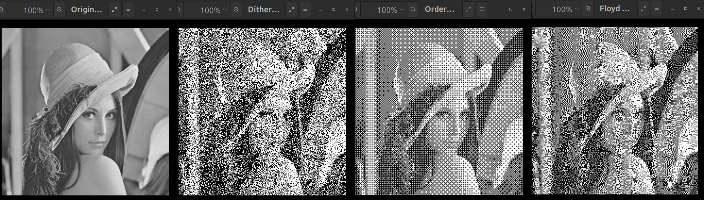

# Dithering
원래 색을 정확히 표현할 수 없는 경우, **의도적으로 픽셀을 흩뿌려 노이즈처럼 배치하여 사람 눈에는 더 풍부한 색 $\cdot$ 계조로 보이도록 하는 방법**이다.

픽셀 단위에서 손실을 보완하기 어렵기 때문에, **이웃 픽셀들의 패턴**으로 시각적 착시를 유도한다.
예를 들어 128(회색)을 흑백만으로 표현해야 한다면, 흰색과 검은색 픽셀을 섞어 **회색처럼 보이게** 만든다.

아래 GrayScale Lena 이미지를 이용해 설명을 해보겠다.

원본 Lena 영상은 256단계의 GrayScale 영상이다. 그러나 이를 단순히 흑(0)과 백(255) 두 가지 값으로만 표현한다면 대부분의 중간 단계가 사라지고,
부드러운 톤의 변화는 계단처럼 뚝뚝 끊겨 보인다. 

이 문제를 해결하기 위해 사용되는 기법이 바로 **디더링(Dithering)**이다. 디더링은 픽셀을 흑과 백으로만 찍되, 그 분포와 배치를 조절하여 사람 눈에는
중간 톤이 있는 것처럼 보이도록 하는 방법이다.

원본 Lena 영상은 모자와 얼굴, 배경에 걸쳐 다양한 회색이 부드럽게 표현되어 있다. 이 영상을 1비트(흑백)으로 줄이면 대부분의 계조가 손실되는데, 
디더링 기법은 이런 손실을 시각적으로 보정하려는 시도이다.

## Ordered Dithering

위 이미지는 Ordered Dithering의 결과이다. 이 방식은 작은 임계값 행렬(예: Bayer Matrix)을 반복적으로 영상에 적용하여 픽셀을 흑백으로 결정한다.

그 결과 규칙적인 점무늬나 격자 패턴이 나타난다. 멀리서 보면 회색조가 표현된 것처럼 보이지만, 가까이 보면 일정한 점 배열이 눈에 띈다.

장점은 계산이 단순하고 빠르다는 것이며, 단점은 패턴이 눈에 거슬릴 수 있다는 점이다.

## Random Dithering
_screenshot_29.09.2025.png)

위 이미지는 Random Dithering의 결과이다. 

각 픽셀에 대해 무작위 임계값을 부여해 흑백을 결정한다. 그 결과 노이즈 같은 분포가 나타나며, 일정한 패턴은 없지만 영상 전체적으로 회색조가 느껴지게
한다.

다만 노이즈 성격이 강해 품질이 떨어져 보일 수 있다. 

이 방식은 간단하지만, 다른 기법들에 비해 시각적으로 거칠게 보일 수 있다.

## Floyd-Steinberg Dithering(Error Diffusion)

위 이미지는 Floyd-Steinberg Dithering, Error Diffusion의 결과이다. 

이 방법은 픽셀을 흑백으로 양자화하면서 발생하는 오차를 인접 픽셀에 분산시켜 전체 영상의 톤 균형을 유지한다. 그 결과, Ordered Dithering처럼 규칙적인 패턴은
덜하고, 사진에 가까운 자연스러운 질감을 얻을 수 있다.

사람 눈에는 회색이 부드럽게 보이지만, 확대해보면 불규칙하게 흩뿌려진 점들로 구성되어 있다.

## Error Diffusion Dithering
Error Diffusion Dithering에 대해 좀 더 자세히 알아보자.

Error Diffusion은 말 그대로 Error를 확산하는 것이다. 
특정 픽셀이 양자화되면서 발생하는 오차를 주변 픽셀에 뿌리는 것이다. 다양한 알고리즘이 존재하지만, 대표적인 **Floyd Steinberg Dithering**에 대해 알아보자.

그레이 스케일 이미지는 보통 0~255(8비트)로 밝기가 표현된다. 이를 흑백(0/255, 1비트)만으로 보여주면 중간 톤이 사라져 밴딩이 생긴다. **오류 확산(Error Diffusion)**은
각 픽셀에서 잃어버린 **양자화 오차**를 주변 픽셀에 "빚처럼" 넘겨 전체적으로 평균 밝기를 지키면서, 점들의 공간 분포로 중간 톤을 **착시적으로 복원**한다.

좀 더 자세히 알아보면,

현재 픽셀 값 $v$를 흑(0) 또는 백(255)으로 **양자화**하면, 오차 $e = v - \hat{v}$ 가 생긴다.($\hat{v}는 양자화 결과) 
이 오차를 아직 처리하지 않은 이웃 픽셀들에 **가중치**를 곱해 더해 둔다. 다음 픽셀을 처리할 때는 "원래 값 + 누적 오차"로 판단하니,
지역적으로 어긋나도 **전체적으로 평균 밝기가 유지**되도록 (편향이 0에 가깝도록) 만든다.

여기서 중요한 점은 **가중치 합이 1**이여야 한다는 점이다. 그 이유는,
 오차 $e$를 $\sum w_i = 1$로 분배하면 **DC(평균) 보존**이 이론적으로 성립한다.
  - $\sum w_i < 1 \to$ 일부 오차가 사라져 평균 밝기가 **조금 어두워짐(감쇠)**
  - $\sum w_i > 1 \to$ 오차가 늘어나 평균 밝기가 **밝아짐(증폭/드리프트)**

 즉, 합이 1이면 장기적으로 **무편향(unbiased)**이 되어 전체 톤이 안정된다.

 처리 순서는 다음과 같다.
 1. **누적값 계산** : $v = I(x, y) + E(x, y)$ (원본 $I$에 주변에서 넘어온 오차 누적 $E$를 더한 값)
 2. **양자화** :$\hat{v} \in {0, 255}$ (보통 임계값 127.5)
 3. **오차 계산** :$e = v - \hat{v}$
 4. **오차 확산** : 아래 이웃들에 $e \times$ {$7/16, 3/16,5/16, 1/16$}을 더해둠
 5. **다음 픽셀로 진행**

 한 줄을 좌 $\to$ 우로만 스캔하면 $45\degree$ 방향의 질감이 생길 수 있다. 이를 줄이려고 보통 **지그재그(serpentine) 스캔**을 사용한다.
 짝수 행은 좌에서 우, 홀수 행은 우에서 좌로 진행하고, **오차 분배 방향도 좌우를 뒤집어** 적용한다. 이렇게 하면 큰 방향성 패턴이 약해진다.

 그렇다면 이 기법이 왜 사진처럼 자연스러울까?

 오류 확산은 오차를 **고주파 쪽으로 '밀어내는'(noise shaping)** 효과가 있다. 사람 눈은 저주파(완만한 변화)에 민감하고, 고주파 잡음에는 둔감하므로,
 결과가 **밴딩 대신 미세한 점질감**으로 보이며 훨씬 자연스럽게 느껴진다.
 ordered보다 패턴 감지가 덜하고, Random보다 밝기 보존과 계조 충실도가 좋다.

### Compare(Original, Random, Ordered, Error Diffusion)
