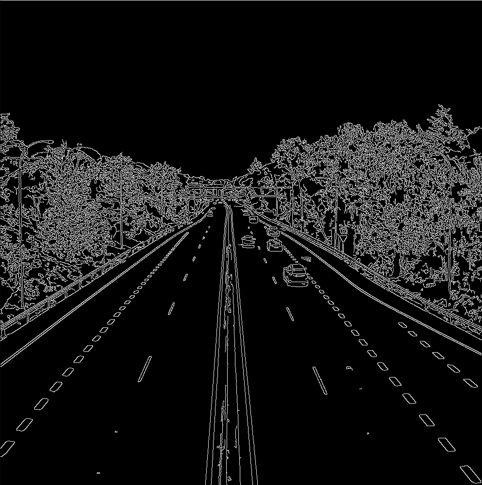
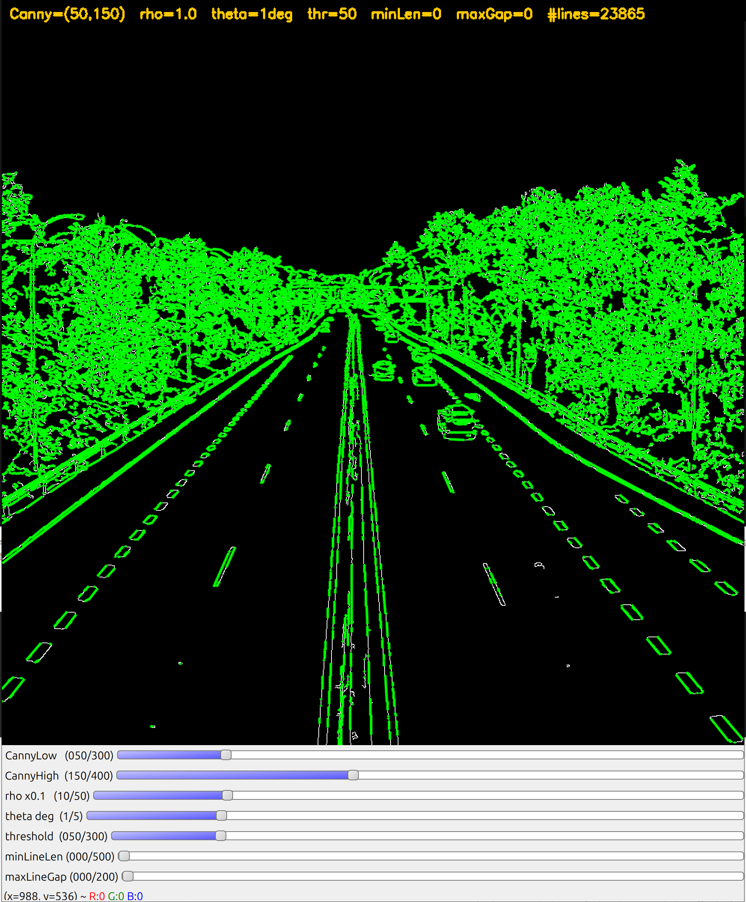
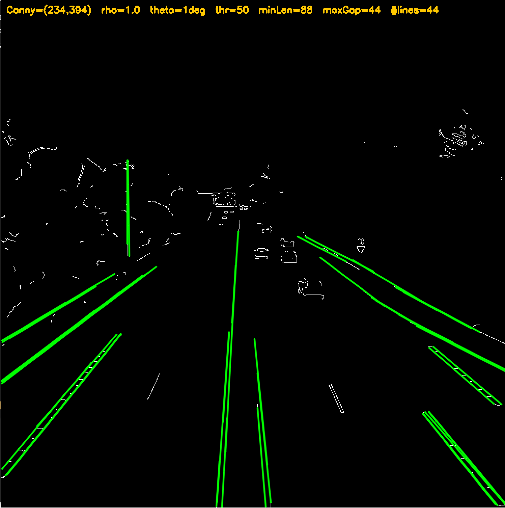

# Hough Line Detector

minLineLen : Line을 결정하는 Edge 길이
이 길이가 커질수록 Line을 결정하는 최소 Edge의 길이가 커지므로, line을 많이 잡지 못해 줄어듦
max line Gap이 매우 작고, MinlineLen이 짧아지면 세부적인 디테일도 선으로 인지하고 선의 개수가 매우 많아짐.

maxLineGap : 두 line의 거리를 비교하여 maxlineGap보다 크면 별개의 line으로, 작으면 하나의 Line으로 취급
Gap이 커질수록 두 line사의 거리가 gap보다 작은 경우가 많아져 Line의 길이가 평균적으로 길어진다.

질문 #1
약한 Line까지 검출할 수 있는 파라미터는 어떻게 설정할지 제안하시오.
 > minLineLen과 maxLineGap 모두 0으로 설정한다.
 

위 영상은 minLineLen과 maxLineGap을 0으로 설정했을 때, HoughLineP 함수가 검출한 Line을 모아둔 영상이다.

minLineLen이 매우 작아 세부적인 디테일또한 선으로 인지하여 약한 Line까지 모두 검출해준다.
단점은 강한 라인에 대해서 긴 하나의 선으로 잡지 못한다는 단점이 존재한다.

질문 #2
강한 Line만을 검출하기 위한 파라미터는 어떻게 설정할지 제안하시오.

강한 에지?
먼저 Canny Edge Threshold값 중 CannyHigh값을 350 이상으로 설정하여
애초에 영상에 강한 에지만 남긴다.

Hough LinesP는 Canny로 검출된 에지 맵을 입력으로 받기 때문에, 
Canny의 임계값을 높여 강한 에지만 남기고 라인 디텍션을 진행한다.
High Threshold를 높여서 강한 경계만 통과하게 한다.

하지만 너무 강한 임계값을 사용하면 실제 존재하는 약한 직선이 누락될 수 있다는 단점이 있다.
예를 들어 흐릿한 경계나 얇은 윤곽선 등은 사라진다.

