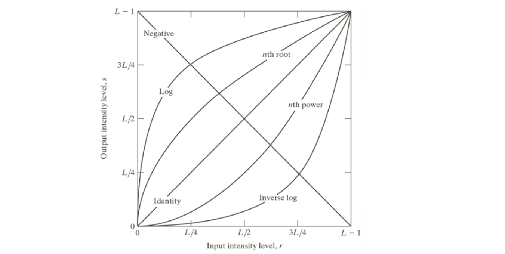
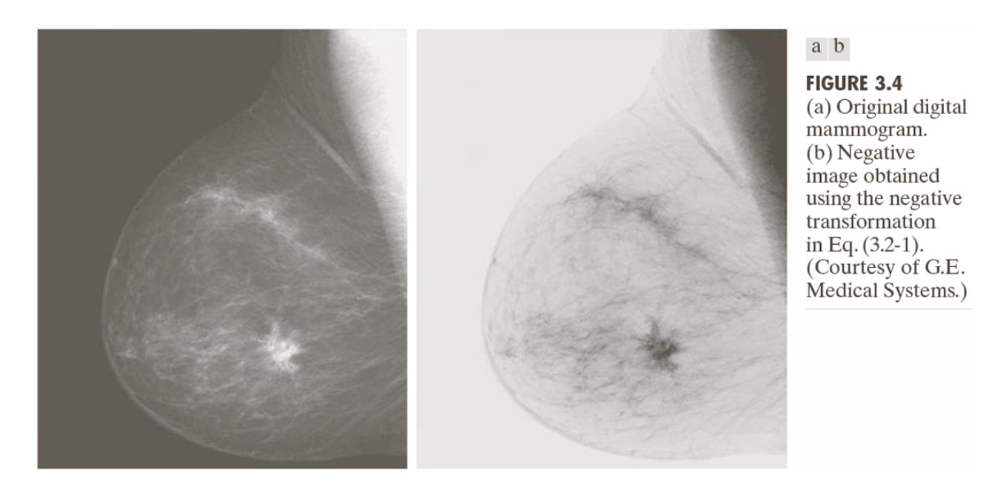
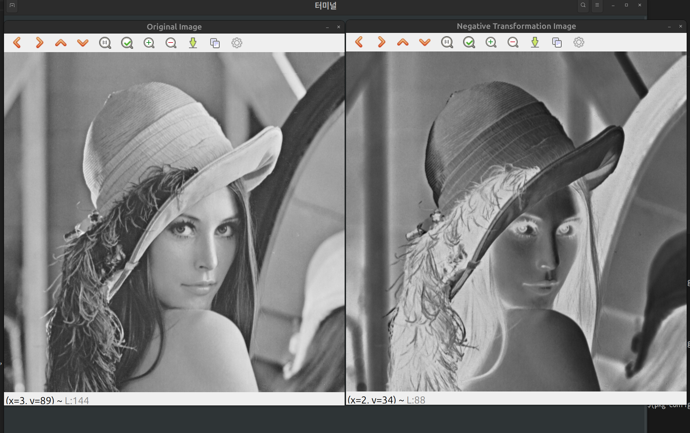

# Negative Transformation

영상 부정 변환,
밝은 부분과 어두운 부분을 서로 반전 시킨다.
수식은 아래와 같다.
$$
s = (L - 1) - r
$$
예를 들어 흰색(255)이 검정(0)으로, 검정이 흰색으로 변환된다.

의료 영상이나 x-ray 이미지에서 더 나은 가시성을 확보하기 위해 사용된다.



## 구현
데이터 접근은 포인터를 이용해 접근한다.
포인터를 이용해 각각 개별 픽셀에 Negative 계산을 진행한다.
```cpp
 unsigned char *pData;
    pData = (unsigned char *)img_out.data;

    for (int h = 0; h < img_in.rows; ++h)
    {
        for (int w = 0; w < img_in.cols; ++w)
        {
            pData[h * img_in.cols + w] = Negative_transformation(img_in, h, w);
        }
    }
```

Negative transformation 함수는 간단하게 255에서 현재 픽셀을 뺀 값만 반환하도록 한다.
```cpp
static inline unsigned char Negative_transformation(const Mat &src, int h, int w)
{
    unsigned char pixel = src.at<uchar>(h, w);

    return static_cast<unsigned char>(255 - pixel);
}
```

## 결과 영상
