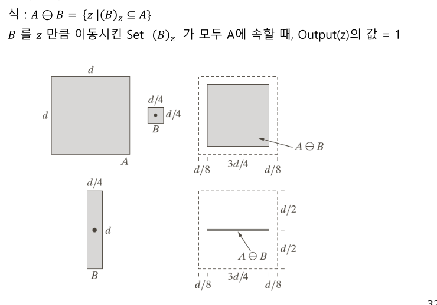
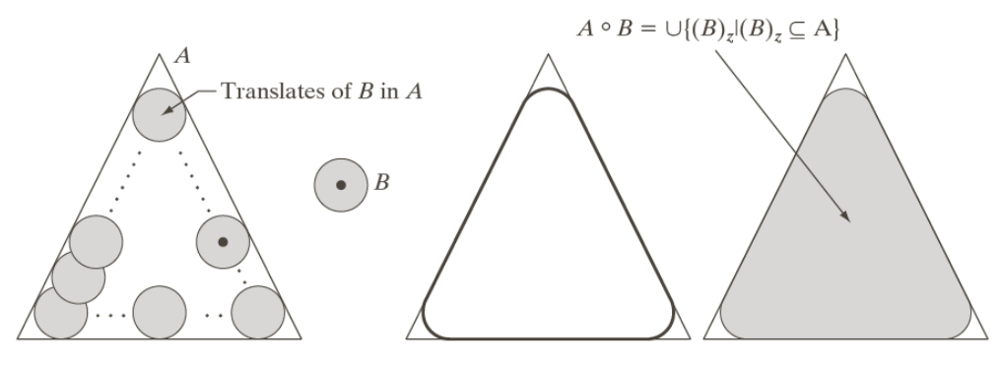
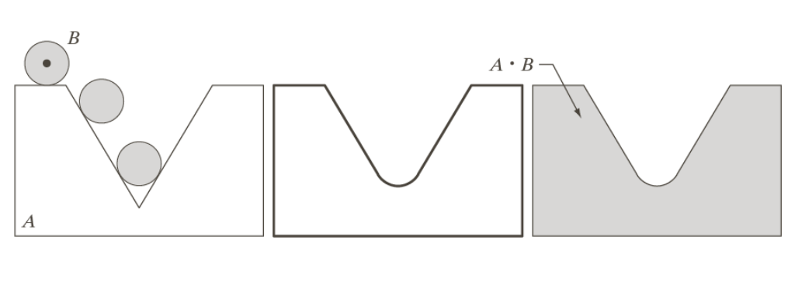

# Morphological Processing
모폴로지 연산(Morphological Operations)은 **영상 내 객체의 형태(shape)**를 다루는 기법으로, 영상의 기하학적 구조를 조작하기 위해 사용된다.
주로 **이진 영상(Binary Image)**에서 적용되며, 픽셀의 공간적 구조를 고려하여 객체를 확장하거나 축소함으로써 형태를 변형한다.

## Morphological Image Processing
### Erosion(침식)

### Dilation(팽창)

### Opening and Closing

### Opening

열린 구간을 버림

### Closing

막힌 공간을 채워줌
### Example

