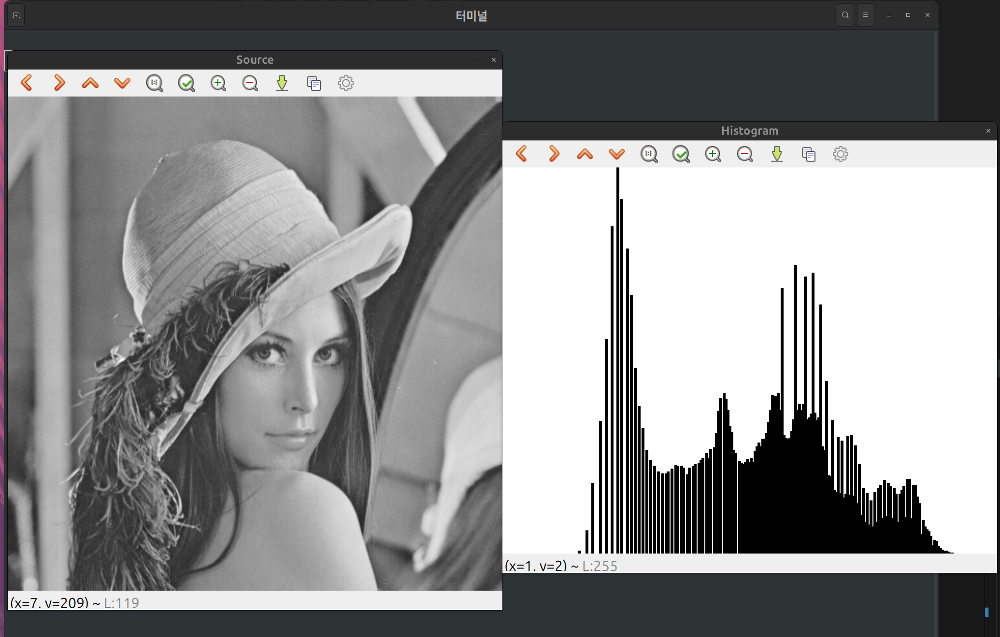

# Histogram Processing
히스토그램 처리는 영상의 밝기 값 분포를 분석하고 조정하는 기법으로, 
디지털 영상 처리에서 가장 기본적이고 중요한 역할을 한다.

히스토 그램은 영상에서 각 픽셀의 밝기 값(그레이 레벨)이 얼마나 자주 나타나는지를 보여주는
그래프이다. X축은 밝기 값(0~255), Y축은 해당 밝기 값의 픽셀 개수를 의미한다.

히스토그램 정규화는 다음과 같이 진행된다.
$$
p(r_k) = \frac{n_k}{MN}
$$
 - $M \times N$ : 영상의 크기
 - $p(r_k)$ : 밝기 값 $r_k$의 확률


## Histogram 구현
먼저 histogram 밝기 값에 대한 빈도 수를 담을 배열을 선언해준다. 
이후 원본 이미지에서 해당 픽셀 값에 대한 빈도 수를 저장한다.
```cpp
int hist[256] = {0,};

for(int h = 0; h < src.rows; ++h){
    for(int w = 0; w < src.cols; ++w){
        hist[src.at<uchar>(h, w)]++;
    }
}
```
히스토그램 그래프를 보여주기 위해서는 그래프를 그릴 스크린과
해당 스크린 크기에 대해  histogram에서 pixel값 분포를 정규화를 해줘야 한다.
스크린의 x축, y축 정규화를 해준 뒤 사각형 그리기를 이용해 히스토그램 그래프를 출력한다.

여기서 주의할 점은 
opencv에서 좌표는 우측 상단이 (0,0), 좌하단이 마지막 좌표가 된다는 점을 꼭 기억해야 한다.

```cpp
    // hist[] > 정규화(0~hist_h 범위)
    int hist_w = 512, hist_h = 400;
    // bin은 막대 하나의 너비. (0-255, 총 256개의 bin)
    // 전체 너비 hist_w를 256으로 나누어 한 bin 당 픽셀 너비를 구함.
    int bin_w = cvRound((double)hist_w / 256); // 즉, 한 구간(bin)을 화면에 몇 픽셀로 그릴지 결정

    Mat histImage(hist_h, hist_w, CV_8UC1, Scalar(255)); // 히스토그램을 그릴 스크린(흰색 스크린)

    // 최대값 찾기
    int max_val = 0;
    for (int i = 0; i < 256; i++)
    {
        if (hist[i] > max_val)
            max_val = hist[i];
    }

    // 막대 그리기
    for (int i = 0; i < 256; i++)
    {
        int height = cvRound(((double)hist[i] / max_val) * hist_h); // 히스토그램 높이 정규화(0~hist_h)
        // 히스토그램 분포 막대 그리기
        rectangle(histImage,
                  Point(i * bin_w, hist_h - height), // 왼쪽 위 꼭짓점
                  Point((i + 1) * bin_w, hist_h),    // 오른쪽 아래 꼭짓점
                  Scalar(0),
                  FILLED);
    }
```
**원본 Lena 이미지의 히스토그램 영상**


## Histogram Equalization

## Histogram Matching
