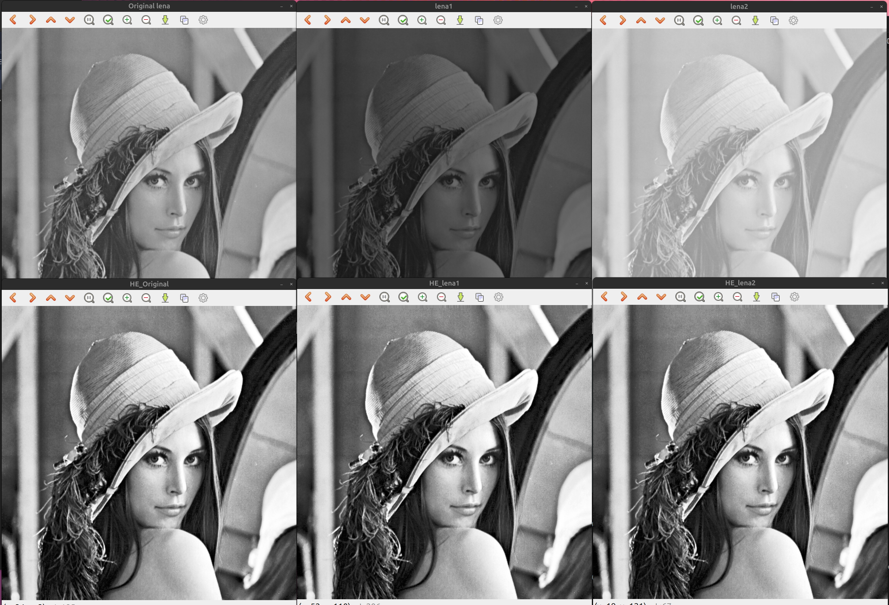

# Histogram Processing
히스토그램 처리는 영상의 밝기 값 분포를 분석하고 조정하는 기법으로, 
디지털 영상 처리에서 가장 기본적이고 중요한 역할을 한다.

히스토 그램은 영상에서 각 픽셀의 밝기 값(그레이 레벨)이 얼마나 자주 나타나는지를 보여주는
그래프이다. X축은 밝기 값(0~255), Y축은 해당 밝기 값의 픽셀 개수를 의미한다.

히스토그램 정규화는 다음과 같이 진행된다.
$$
p(r_k) = \frac{n_k}{MN}
$$
 - $M \times N$ : 영상의 크기
 - $p(r_k)$ : 밝기 값 $r_k$의 확률


## Histogram 구현
먼저 histogram 밝기 값에 대한 빈도 수를 담을 배열을 선언해준다. 
이후 원본 이미지에서 해당 픽셀 값에 대한 빈도 수를 저장한다.
```cpp
int hist[256] = {0,};

for(int h = 0; h < src.rows; ++h){
    for(int w = 0; w < src.cols; ++w){
        hist[src.at<uchar>(h, w)]++;
    }
}
```
히스토그램 그래프를 보여주기 위해서는 그래프를 그릴 스크린과
해당 스크린 크기에 대해  histogram에서 pixel값 분포를 정규화를 해줘야 한다.
스크린의 x축, y축 정규화를 해준 뒤 사각형 그리기를 이용해 히스토그램 그래프를 출력한다.

여기서 주의할 점은 
opencv에서 좌표는 우측 상단이 (0,0), 좌하단이 마지막 좌표가 된다는 점을 꼭 기억해야 한다.

```cpp
    // hist[] > 정규화(0~hist_h 범위)
    int hist_w = 512, hist_h = 400;
    // bin은 막대 하나의 너비. (0-255, 총 256개의 bin)
    // 전체 너비 hist_w를 256으로 나누어 한 bin 당 픽셀 너비를 구함.
    int bin_w = cvRound((double)hist_w / 256); // 즉, 한 구간(bin)을 화면에 몇 픽셀로 그릴지 결정

    Mat histImage(hist_h, hist_w, CV_8UC1, Scalar(255)); // 히스토그램을 그릴 스크린(흰색 스크린)

    // 최대값 찾기
    int max_val = 0;
    for (int i = 0; i < 256; i++)
    {
        if (hist[i] > max_val)
            max_val = hist[i];
    }

    // 막대 그리기
    for (int i = 0; i < 256; i++)
    {
        int height = cvRound(((double)hist[i] / max_val) * hist_h); // 히스토그램 높이 정규화(0~hist_h)
        // 히스토그램 분포 막대 그리기
        rectangle(histImage,
                  Point(i * bin_w, hist_h - height), // 왼쪽 위 꼭짓점
                  Point((i + 1) * bin_w, hist_h),    // 오른쪽 아래 꼭짓점
                  Scalar(0),
                  FILLED);
    }
```
**원본 Lena 이미지의 히스토그램 영상**


## Histogram Equalization

### 구현
**1) Histogram 계산**
영상 전체 픽셀을 훑어서 각 밝기 레벨(0-255)이 몇 번 나오는지 세는 과정이다.
이 분포가 Histogram 이다.
```cpp
 // 히스토그램 계산
    int hist[256] = {
        // 히스토그램 초기화
        0,
    };

    unsigned char *sdata;
    sdata = (unsigned char *)src.data;

    if (src.isContinuous())
    {
        const size_t Nbytes = rows * sstep;
        for (size_t i = 0; i < Nbytes; ++i)
        {
            hist[sdata[i]]++; // 픽셀값(0-255)의 빈도 수 계산
        }
    }
```

**2) 누적 분포 cdf 계산**
0부터 현재 밝기까지 픽셀이 몇 개 있는지 누적한 값이다.
$$
\text{cdf}(k) = \sum_{j=0}^k \text{hist}(j)
$$
직관적으로는, "이 픽셀 값 이하인 픽셀이 전체에서 몇 %인가?"를 표현하는 누적 분포 함수이다.
이 값은 픽셀 값의 상대적 위치(확류적 순위)를 알려준다.

```cpp
// cdf 계산 (표준 누적 분포)
    int cdf[256];
    cdf[0] = hist[0];
    for (int i = 1; i < 256; ++i) // 0부터 현재 밝기까지 픽셀이 몇 개 잇는지 누적한 값
    {
        cdf[i] = cdf[i - 1] + hist[i];
    }
```

**3) $cdf_{min}$ 추출
영상에서 실제로 등장하는 가장 낮은 밝기의 첫 누적 값

영상 밝기 0 픽셀이 전혀 없다면, 그냥 `cdf(k)/N`을 쓰면 최소 밝기가 0이 되지 않는다.
그래서 `cdf_min`을 빼주어 실제 최소 밝기를 0으로 매핑하기 위함이다.

즉, 동적 범위를 낭비하지 않고, 가장 어두운 픽셀을 0, 가장 밝은 픽셀을 255로 맞추려는 조정 값이다.
```cpp
    // cdf 최소값 찾기, 영상에서 실제로 등장하는 가장 낮은 밝기의 첫 누적 값, 실제 최소 밝기를 0으로 매핑하가 위해 구한다.
    int cdf_min = 0;
    for (int i = 0; i < 256; ++i)
    {
        if (cdf[i] > 0)
        {
            cdf_min = cdf[i];
            break;
        }
    }
```

**4) Look Up Table 생성**
각 입력 밝기 k를 어떤 새로운 밝기 값으로 바꿀지 미리 계산해 둔 변환표이다.
수식 그대로 CDF를 [0, 255] 범위로 선형 정규화한다.
이 LUT는 어두운 픽셀은 더 어둡게, 밝은 픽셀은 더 밝게해서 전체 분포를 균등하게 퍼트리도록 만든다.
따라서 LUT는 히스토그램 평활화의 핵심 매핑 함수이다.

```cpp
 // Look Up Table 생성 s_k = round( (cdf[k] - cdf_min) / (N - cdf_min) * 255 )
    const int N = rows * cols;
    unsigned char lut[256];
    if (N == cdf_min)
    {
        // 모든 픽셀이 같은 값이 경우 동일 매핑
        for (int i = 0; i < 256; ++i)
        {
            lut[i] = static_cast<unsigned char>(i);
        }
    }
    else
    {
        for (int k = 0; k < 256; ++k)
        {
            double sk = (static_cast<double>(cdf[k] - cdf_min) / (N - cdf_min)) * 255.0;
            if (sk < 0.0)
                sk = 0.0;
            if (sk > 255.0)
                sk = 255.0;
            lut[k] = static_cast<unsigned char>(std::lround(sk));
        }
    }
```
이후 LUT를 적용하여, 최종 결과를 낸다.
```cpp
// lut 적용하여 출력 생성
    Mat dst(rows, cols, CV_8UC1);
    unsigned char *dData;
    dData = (unsigned char *)dst.data;

    const size_t dstep = dst.step;

    for (int h = 0; h < rows; ++h)
    {
        const unsigned char *srow = sdata + h * sstep;
        unsigned char *drow = dData + h * dstep;
        for (int w = 0; w < cols; ++w)
        {
            drow[w] = lut[srow[w]];
        }
    }

    return dst;
```

### 결과 영상


결과 영상이 동일해보인다. 왜그럴까?

핵심 이유는 **히스토그램 평활화(HE)는 픽셀의 “순위(누적분포)”에만 의존**하고, `src/2`, `128 + src/2` 같은 **단조 증가 선형 변환**은 **픽셀의 순위를 보존**하기 때문이다. 순위가 같으면 HE 결과도 사실상 같다.

* `lena1 = src/2`와 `lena2 = 128 + src/2`는 모두 ( r' = a r + b ) 꼴의 **단조 증가( (a>0) )** 변환이다.
* HE는 출력 ( s )를 $( s = (L-1)\cdot \text{CDF}(r) )$처럼 **CDF(누적분포함수)**로 매핑한다.
* 단조 증가 변환은 **값의 순서를 보존**하므로, 변환 후의 CDF로 평활화를 해도 원본과 **동일한 순위 기반 매핑**이 일어난다.
* 따라서 세 경우의 HE 결과 영상은 이론적으로 **동일**이며, 실제 8비트 이산화·양자화 때문에 **아주 미세한 차이**만 있을 수 있다.

#### 개념 설명

1. **히스토그램 평활화의 본질**
   HE는 각 픽셀 값을 그 값 이하의 비율(누적확률)로 치환하는 과정이다. 즉,

   * “밝기 순서”만 중요하고, 절대값의 스케일이나 옵셋은 중요하지 않다.
   * 순위(오더)가 같으면 결과도 같다.

2. **단조 증가 선형 변환은 순위 보존**
   $( r' = a r + b )$ ( $(a>0)$ )이면, 두 픽셀 $(r_i < r_j)$일 때 $($r'_i < r'_j)$가 항상 성립한다.
   → 픽셀의 **상대적 순서(랭크)**가 그대로 유지된다.

3. **CDF 관점의 불변성**
   변환 후 CDF는
   $$
   F_{r'}(k) = P(r' \le k) = P(r \le \tfrac{k-b}{a}) = F_r!\left(\tfrac{k-b}{a}\right)
   $$
   HE는 $( s = (L-1),F(\cdot) )$이므로,
   $$
   s' = (L-1),F_{r'}(r') = (L-1),F_r(r) = s
   $$
   이상적(연속) 환경에서는 **완전히 동일한 결과**가 된다. 코드에서 쓰는 (cdf_{\min}) 보정도 결국 “최저 등장 레벨을 0으로 붙이기”여서 **순위 기반 매핑**이라는 본질은 변하지 않는다.

#### 수식

* 히스토그램 평활화 매핑:
  $$
  s_k ;=; \operatorname{round}!\left(\frac{\mathrm{cdf}(k)-\mathrm{cdf}*{\min}}{N-\mathrm{cdf}*{\min}},(L-1)\right)
  $$
* 단조 증가 선형 변환 후 CDF:
  $$
  F_{r'}(k) ;=; F_r!\left(\frac{k-b}{a}\right),\quad a>0
  $$
* 평활화 결과 불변성(이상적 연속 상황):
  $$
  (L-1),F_{r'}(r') ;=; (L-1),F_r(r)
  $$

#### 추가 설명 및 응용

* **왜 눈으로 거의 같게 보이나?**
  8비트 이산화(256 레벨)와 반올림 때문에 픽셀 몇 개 수준의 차이는 생길 수 있으나, 전체 톤은 같아 보인다. 특히 `src/2`는 대비가 줄지만 HE가 다시 **동적 범위를 0~255로 확장**하면서 원본과 유사한 톤을 복원한다. `128+src/2`처럼 상단으로 이동한 경우에도 HE가 하한을 0으로 “끌어내리고” 상한을 255로 “끌어올려” 결과가 비슷해진다.
* **언제 달라질까?**

  * **단조 감소**(예: 네거티브 (a<0))는 순서를 뒤집으므로 결과가 달라진다.
  * **지역 히스토그램 평활화(CLAHE)**는 지역창마다 CDF를 쓰므로 원본/선형변환 간 결과가 달라질 수 있다.
  * **강한 양자화·클리핑**으로 많은 값이 같은 bin에 몰리면 이산화 차이가 커질 수 있다.
* **검증 방법(간단 실험)**
  HE 결과끼리 `absdiff(HE_src, HE_lena1)`의 평균·최댓값을 보면 거의 0에 가깝게 나온다(소수 픽셀 차이).

요약하면, **히스토그램 평활화는 “값의 순위”로 픽셀을 다시 배치하는 연산**이므로, **단조 증가(선형·감마 포함) 변환을 먼저 해도 결과는 사실상 동일**해지는 것이 원리적으로 맞다.

## Histogram Matching
